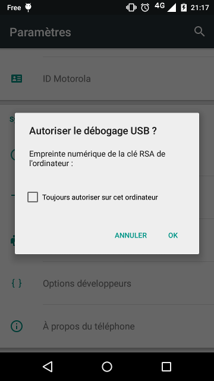

# FreeOTP configuration export/import

## Prerequiresites

### System setup to detect an Android device

Android device detection over USB in order to run/debug/test applications.

```shell
# list usb devices, in this case a Motorola Android device
[:~] $ lsusb | grep Motorola
Bus 002 Device 065: ID 22b8:2e76 Motorola PCS
# setup rules for the specific devices with idVendor:idProduct pattern
[:~] $ sudo vim /etc/udev/rules.d/51-android.rules
SUBSYSTEM=="usb", ATTR{idVendor}=="22b8", ATTR{idProduct}=="2e76", MODE="0666", GROUP="plugdev"
[:~] $ chmod a+r /etc/udev/rules.d/51-android.rules
# reload udev rules
[:~] $ sudo udevadm control --reload-rules
```

### Android developer mode activation

Needed for `adb` -*Android Developer Bridge*- tools usage.

- Go to Android, go to Settings > About phone > **Build number**
- Tap Build number seven times
- Go back to Settings, a **Developer options** entry is now availabled
- Activate the Developer options features
- Enable **USB debugging** mode

### Android Developer Bridge setup

Establish a connection to the Android device.

```shell
# install adb package -see https://www.xda-developers.com/install-adb-windows-macos-linux/ or https://dl.google.com/android/repository/platform-tools-latest-linux.zip otherwise-
[:~] $ sudo apt-get install adb
# generate RSA key if not already done
[:~] $ adb keygen .android/adbkey
adb I 05-04 21:15:35  9982  9982 adb_auth_host.cpp:109] generate_key(.android/adbkey)...
adb I 05-04 21:15:35  9982  9982 adb_auth_host.cpp:77] write_public_keyfile...
adb I 05-04 21:15:35  9982  9982 adb_auth_host.cpp:56] get_user_info...
# > connect by usb computer and android devices
# list devices
[:~] $ adb devices
List of devices attached
* daemon not running; starting now at tcp:5037
* daemon started successfully
# device not already connected -need to accept authentication-
[:~] 3s $ adb devices
List of devices thorized
```

A prompt will be displayed on the android device -authorize debbuging mode.



```shell
# device is now recognized and authenticated
[:~] $ adb devices
List of devices attached
TA348003RO      device
# appends new header information to the file and saves it as decompressed-data.tar
# test device connection
[:~] $ adb shell
shell@peregrine:/ $ exit
```

## FreeOTP export/import

Export/Import will consist in :
- backup the FreeOTP configuration of an Android device
- set this backup readble (xml configuration file convertion)
- use a third-party script to re-generate QR code from the generate configuration
- scan the generated QR code by the new device FreeOTP instance

### Configuration export

```shell
# backup freeotp configuration
[:~] $ adb backup -f ~/freeotp.ab -noapk org.fedorahosted.freeotp
# > accept backup operation on the device
Now unlock your device and confirm the backup operation...
[:~] $ ls
freeotp.ab
# uses the Unix dd utility to rewrite the new file, saving it as “compressed-data” and skipping the first 24 bytes of data from the source
[:~] $ dd if=freeotp.ab bs=1 skip=24 > compressed-data
1880+0 records in
1880+0 records out
1880 bytes (1.9 kB, 1.8 KiB) copied, 0.0269049 s, 69.9 kB/s
# appends new header information to the file and saves it as decompressed-data.tar
[:~] $ printf "\x1f\x8b\x08\x00\x00\x00\x00\x00" | cat - compressed-data | gunzip -c > decompressed-data.tar
gzip: stdin: unexpected end of file
# uncompress configuration files
[:~] $ tar -xvf decompressed-data.tar
apps/org.fedorahosted.freeotp/_manifest
apps/org.fedorahosted.freeotp/sp/tokens.xml
# OTP configuration is available in the tokens.xml file
[:~] $ cat apps/org.fedorahosted.freeotp/sp/tokens.xml
<?xml version='1.0' encoding='utf-8' standalone='yes' ?>
<map>
...
</map>
```

### Configuration import

Use `Viljo Viitanen` [QR code XML exporter tool](https://github.com/viljoviitanen/freeotp-export) to read the `tokens.xml` file and generate QR code copies of exported configuration.

### Import limitation and workaround

There is a script limitation due to QR code entry name length : `qrcode.min.js:1 Uncaught Error: code length overflow. (1612>1056)`

In case of QR code display error by the script, edit the `tokens.xml` files, modify corresponding entries names if needed and re-import the configuration file.
